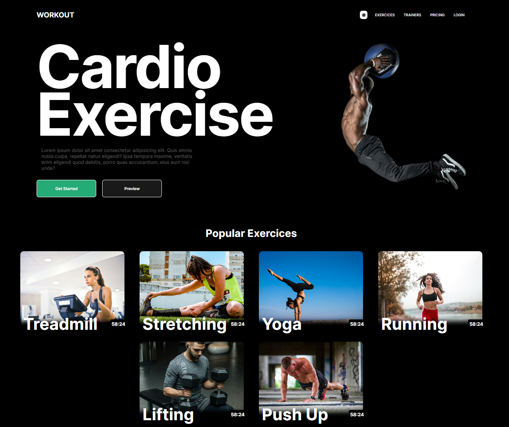
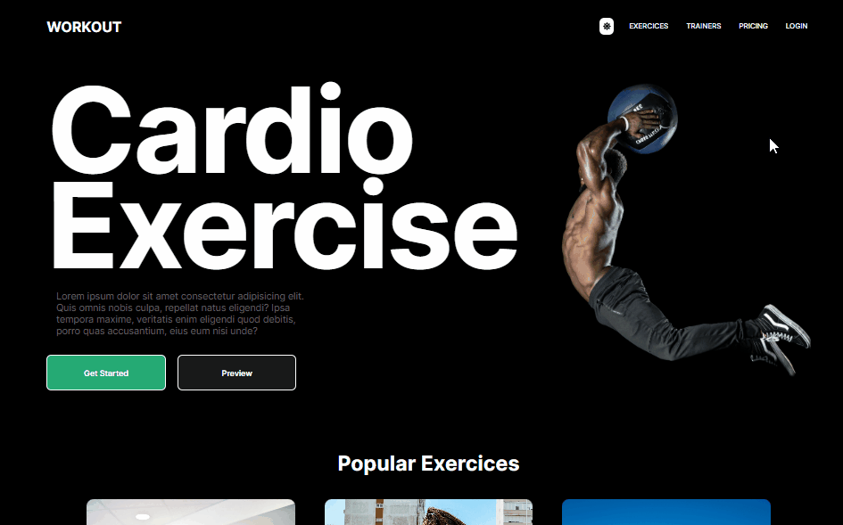
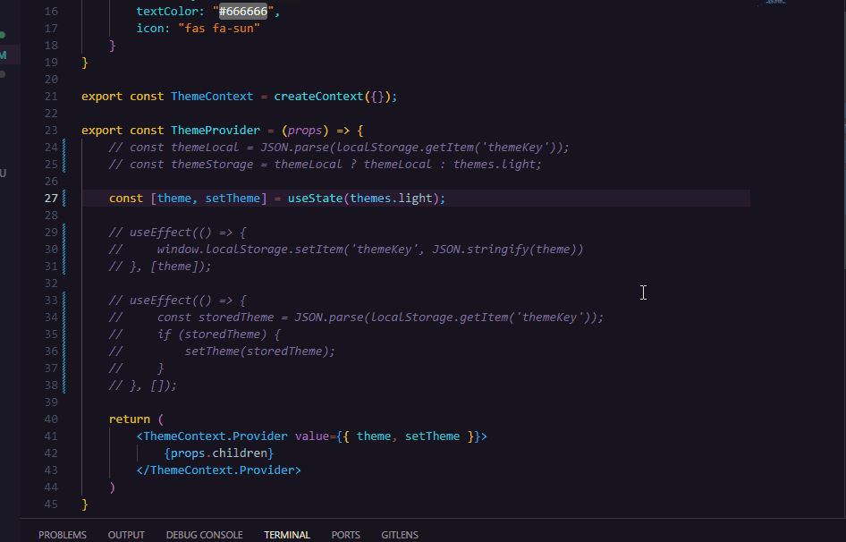
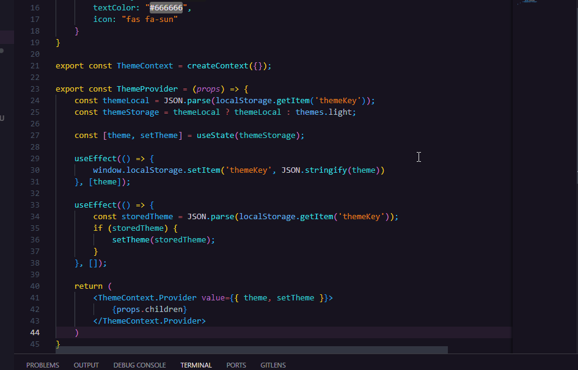

# Projeto pessoal: Landing Page com useContext e LocalStore em React

🧾✍ Este projeto foi baseado neste [Projeto Figma](https://www.figma.com/file/k1DNeyUX1Go6PzK745JEjm/Fitness-Landing-Page-(Community)?type=design&node-id=0-1&mode=design&t=6ri2f4Hb4lgjpXNu-0).



## Sumário

- [Visão Geral](#visão-geral)
  - [O desafio](#o-desafio)
  - [Screenshot e gifs](#screenshot-e-gifs)
- [Meu processo](#meu-processo)
  - [Tecnologias utilizadas](#tecnologias-utilizadas)
  - [Funcionalidade do projeto](#funcionalidade-do-projeto)
  - [Como executar o projeto](#como-executar-o-projeto)
  - [Desenvolvimento contínuo](#desenvolvimento-contínuo)
  - [Agradecimentos](#agradecimentos)
  - [Recursos úteis](#recursos-úteis)
- [Autor](#autor)


## Visão-geral

### O desafio

Objetivos:

- Criar um botão que mude o tema de fundo da página entre light e dark;
- Guardar os dados do tema no localStore para que, ao recarregar a página, o tema escolhido permanecesse, não comente o tema padrão;
- Utilizar o hook useContext para enviar os dados do tema para todos os componentes, assim diminuir o uso de props;
- Criar botões interativos que possam alterar seus estivos utilizando o ```hover```;
- Gerar responsividade à página para que possa ser melhor visualizada em todos os dispositivos.

### Screenshot e gifs

#### Funcionalidade do projeto


#### Responsividade do projeto


#### Hover



## Meu processo

### Tecnologias utilizadas

- JavaScript
- React
- Vite
- styledComponents
- Context API
- useContext
- useState
- useEffect
- localStore

### Funcionalidade do projeto
O objetivo principal é criar uma página que alterne entre os temas "dark" e "light" ao clicar no botão posicionado no header. Para isso, foi necessário utilizar o "Context API", que é uma API do react, onde eu crio um contexto em que as informações que quero passar para todos os meus componentes serão salvas nele. Dessa forma eu evito o [Prop Drilling](https://www.alura.com.br/artigos/prop-drilling-no-react-js?utm_term=&utm_campaign=&utm_source=adwords&utm_medium=ppc&hsa_acc=7964138385&hsa_cam=20987928442&hsa_grp=157916200306&hsa_ad=689395782879&hsa_src=g&hsa_tgt=dsa-2273097816642&hsa_kw=&hsa_mt=&hsa_net=adwords&hsa_ver=3&gad_source=1&gclid=Cj0KCQiA5-uuBhDzARIsAAa21T_AxdbFCWCfuq5gVHnCFGok4TEr7F7UK3vmd2m2DHPIO6qBCWtU7SMaAqHjEALw_wcB), pois não preciso criar props sempre que quero transmitir informações entre meus componentes pais e filhos. 

A princípio foi criado o contexto "theme-context", onde nele guardo meu objeto que possui os detalhes dos estilos de cada tema da página.

```jsx
export const themes = {
    light: {
        color: "#000000",
        backgroundColor: "#eeeeee",
        secondaryColor: "#aaaaaa",
        textColor: "#666666",
        icon: "fas fa-moon"
    },
    dark: {
        color: "#ffffff",
        backgroundColor: "#000000",
        secondaryColor: "#191919",
        textColor: "#666666",
        icon: "fas fa-sun"
    }
}
```

Dessa forma consigo criar um estado para guardar e alterar o tema quando necessário, onde o tema padrão (default), o primeiro a ser carregado quando o usuário acessar a página, será sempre o light.

```jsx
export const ThemeContext = createContext({});

export const ThemeProvider = (props) => {
    const [theme, setTheme] = useState(theme.light);

    return (
        <ThemeContext.Provider value={{ theme, setTheme }}>
            {props.children}
        </ThemeContext.Provider>
    )
}
```

Além disso, o contexto já foi criado e possui como valor, que será transmitido aos meus outros componentes, o "theme" que é o tema padrão em si, e o "setTheme" responsável por alterar o meu tema que será utilizado pelo meu botão para mudar para o tema dark. O provedor também foi criado, onde será utilizado no componente **App** que renderiza os demais componentes na tela.

```jsx
import { Container } from "./components/container"
import { ThemeProvider } from "./contexts/theme-context.jsx"

function App() {
  return (
    <ThemeProvider>
      <Container />
    </ ThemeProvider>
  )
}
```

Todos os componentes que estiverem dentro do componente **ThemeProvider** terá a capacidade de utilizar os dados do context, ou seja, o **theme** e o **setTheme**.

Os demais componentes foram todos armazenados em outro componente antes de ir para o **App**, que é o **Container**.

```jsx
export const Container = () => {
    const { theme } = useContext(ThemeContext);
    return (
        <Div style={{ backgroundColor: theme.backgroundColor }}>
            <Section>
                <Header />
                <Hero />
                <PopularExercises />
                <WorkoutProgram />
                <TrainingPrograms />
            </Section>
        </Div>
    )
}
```

Como vemos acima, após criarmos o Contexto e o Provedor do Context API, todos os componentes englobados pelo provedor podem utilizar os dados do contexto. Ao utilizar a desestruturação de objetos, posso coletar qualquer valor do contexto utilizando o hook ```useContext``` e, entre parênteses, coloco o contexto que quero utilizar, pois posso ter mais de um contexto por projeto. No nosso caso, chamamos o nosso ThemeContext ```useContext(ThemeContext)```. Por fim, posso utilizar os dados do meu objeto, como a cor do background, color, secondaryColor, etc.

Por fim, posso alternar o tema ao clicar no meu botão, que recebeu a propriedade setTheme, para alternar o tema. Assim, todos os componentes que estão utilizando o estado do **theme** irão alternar juntos ao acionarmos a função que troca o tema.

```jsx
export const ThemeTogglerButton = () => {
    const { theme, setTheme } = useContext(ThemeContext);

    const toggleTheme = () => {
        setTheme(theme === themes.light ? themes.dark : themes.light);
    };

    return (
        <>
            <Button onClick={toggleTheme}>
                <FontAwesomeIcon icon={theme.icon} />
            </Button>
        </>
    )
}
```

Na linha 5 acima o código utiliza o setTheme e confere se o tema atual é light, assim será alternado para dark, caso não, será alternado para light.

O nosso contexto não precisa englobar tudo, pois algumas vezes é mais útil utilizar props, caso vamos passar somente uma informação entre um componente pai para um filho. Foi o caso do meu componente **PopularExercises**, onde cada exercício possuia o mesmo design e formato, assim eu só precisava mudar a fonte da imagem e o ```alt```, que possui a descrição da imagem. Dessa forma, criei um componente responsável pelo design de cada vídeo, o componente **Exercise** e outro componente responsável por carregar a interface ao usuário, o **PopularExercises**.

```jsx
export const PopularExercises = () => {
    const { theme } = useContext(ThemeContext);
    return (
        <Container style={{ color: theme.color }}>
            <Title>Popular Exercises</Title>
            <Exercises>
                <Exercise src={treadmill} alt="treadmill" title="Treadmill"/>
                <Exercise src={stretching} alt="stretching" title="Stretching"/>
                <Exercise src={yoga} alt="yoga" title="Yoga"/>
                <Exercise src={running} alt="running" title="Running"/>
                <Exercise src={lifting} alt="lifting" title="Lifting"/>
                <Exercise src={pushUp} alt="push up" title="Push Up"/>
            </Exercises>
        </Container>
    )
}
```
Os temas foram definidos e também podem ser alternados. Porém, um problema encontrado é que quando recarregamos a página, o nosso tema anteriormente escolhido não é salvo. Dessa forma, o tema padrão, o light, sempre será recarregado quando o usuário recarregar a página, como podem observar no gif abaixo sem o uso do localStore.



Assim, para que o tema escolhido seja salvo, é necessário utilizar o localStore, como o nome diz, é um armazenador local de informações utilizado pelo próprio navegador. Passamos para o localStore o nosso tema e, caso o tema seja dark, o localStore irá guardar aquela informação e, ao recarregar a página, o tema anteriormente selecionado permanecerá, graças à informação que foi salva dentro do próprio navegador do usuário.



Para concluir, também utilizei o styledComponents, para me ajudar a estilizar os meus componentes de forma individual. Basicamente criamos uma variável que será utilizada como um componente pela biblioteca styledComponents e assim posso utilizá-lo dentro do meu componente. Dessa forma, o estilo definido a ele será renderizado.

```jsx
const Button = styled.button`
    padding: 20px;
    width: 200px;
    border: none;
    border-radius: 8px;
    font-weight: 600;
    transition: .3s;
    cursor: pointer;
    border: 1px solid #ffffff;
    &:hover {
        box-shadow: 0 0 10px #25ab75;
        border: 1px solid #ffffff;
    }
    @media (max-width: 680px) {
        padding: 15px;
        width: 150px;
    }
`
```

### Como executar o projeto
- O projeto foi realizado através do [React-Vite](https://vitejs.dev).

- Ao baixar o projeto, abrir o terminal do VSCode e digitar o código de instalação das dependências: **npm install**

- O arquivo package.json já possui a versão da biblioteca em seus dados, portanto todas as bibliotecas utilizadas nesse projeto serão instaladas em sua máquina da mesma forma. Mas caso tenha interesse em como baixar, utilizar ou aprender mais sobre as bibliotecas e API's que foram utilizadas no meu código, além do localStore, acesse os links [Context API](https://legacy.reactjs.org/docs/context.html), [styledComponents](https://styled-components.com/docs), [localStore](https://developer.mozilla.org/en-US/docs/Web/API/Window/localStorage).

- Para rodar o projeto no navegador é necessário ativar o **NPM Scripts** nos três pontos ao lado do EXPLORER do VSCODE


- Em seguida, na janela inferior esquerda do **NPM SCRIPTS** clicar no botão **run** do package.json/dev vite


- Por fim, no terminal irá aparecer o **local-host** que será executado no seu navegador o projeto. Passe o mouse sobre ele e clique em **Follow link** ou pressione o botão **ctrl** do seu teclado e clique em cima do **local-host** e a página abrirá no seu navegador padrão.


Há outras formas de se abrir o projeto, porém esta é a forma que eu costumo optar em usar.

### Desenvolvimento contínuo

Esse projeto foi um dos primeiros projetos pessoais em que desenvolvi. Eu peguei por inspiração o design deste [Projeto Figma](https://www.figma.com/file/k1DNeyUX1Go6PzK745JEjm/Fitness-Landing-Page-(Community)?type=design&node-id=0-1&mode=design&t=6ri2f4Hb4lgjpXNu-0). Mas o conhecimento necessário para desenvolve-lo foi graças a toda equipe do curso [DevQuest](https://www.linkedin.com/school/devquest-dev-em-dobro/), onde aprendi mais sobre React, context API e todos os demais conhecimentos adquiridos sobre programação até hoje. Agradeço a todos os meus professores.

### Recursos úteis

- [Responsive Viewer](https://chromewebstore.google.com/detail/responsive-viewer/inmopeiepgfljkpkidclfgbgbmfcennb) - Essa extensão do navegador nos ajuda a visualizar o projeto através das telas dos diversos dispositivos, assim, melhorar a responsividade. 
- [Auto rename tag](https://marketplace.visualstudio.com/items?itemName=formulahendry.auto-rename-tag) - Com essa extensão do VSCode é possível alterar, simultaneamente, o valor das tags HTML na sua abertura e fechamento, assim o processo de desenvolvimento do código é acelerado.
- [Live Server](https://marketplace.visualstudio.com/items?itemName=ritwickdey.LiveServer) - Extensão do VSCode que transmite automaticamente no navegador as alterações feitas no projeto, dispensando a necessidade de atualização da página.
- [Context API](https://legacy.reactjs.org/docs/context.html) - Nos proporciona deixar nosso código mais fácil ao transmitir informações entre nossos componentes, nos ajudando a evitar o [Prop Drilling](https://www.alura.com.br/artigos/prop-drilling-no-react-js?utm_term=&utm_campaign=&utm_source=adwords&utm_medium=ppc&hsa_acc=7964138385&hsa_cam=20987928442&hsa_grp=157916200306&hsa_ad=689395782879&hsa_src=g&hsa_tgt=dsa-2273097816642&hsa_kw=&hsa_mt=&hsa_net=adwords&hsa_ver=3&gad_source=1&gclid=Cj0KCQiA5-uuBhDzARIsAAa21T_AxdbFCWCfuq5gVHnCFGok4TEr7F7UK3vmd2m2DHPIO6qBCWtU7SMaAqHjEALw_wcB).
- [styledComponents](https://styled-components.com/docs) - Utilizando **tagged template literals** e o poder do CSS, os componentes estilizados permitem que você escreva código CSS para estilizar componentes. Ele também remove o mapeamento entre componentes e estilos, tornando a estilização de componentes de forma mais fácil.
- [localStore](https://developer.mozilla.org/en-US/docs/Web/API/Window/localStorage) - A propriedade localStorage da interface da janela nos permite acessar um objeto **Storage** para a origem do Documento; os dados armazenados são assim salvos nas sessões do navegador.

## Autor

- GitHub - [Felipe Santiago Morais](https://github.com/SantiagoMorais)
- Linkedin - [Felipe Santiago](https://www.linkedin.com/in/felipe-santiago-873025288/)
- Frontend Mentor - [@FelipeSantiagoMorais](https://www.frontendmentor.io/profile/SantiagoMorais)
- Instagram - [@felipe.santiago.morais](https://www.instagram.com/felipe.santiago.morais)
